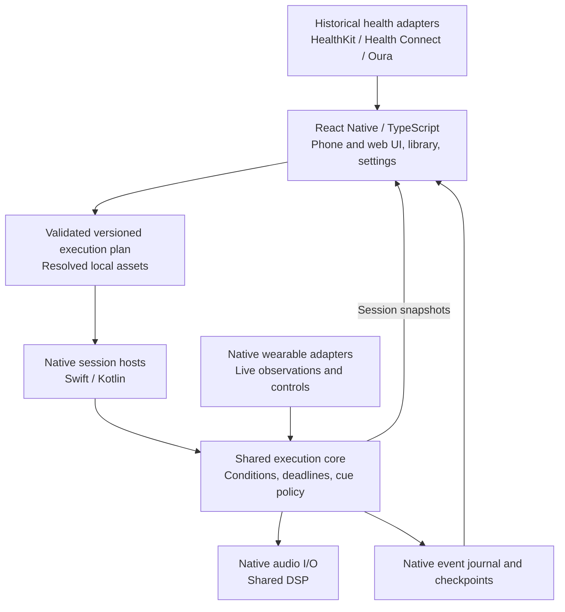

# LucidDream v3 - Native Runtime, Live Sensing and Adaptive Nights

Status: **reserved architecture and candidate scope, not yet planned for delivery.** Created
2026-09-13 by moving the native-runtime architecture out of
[luciddream-v2-plan.md](luciddream-v2-plan.md), where it had been chapter 1, after the v2 planning
session decided that every v2 feature runs on the existing React Native / TypeScript stack.

Read [luciddream-v2-plan.md](luciddream-v2-plan.md) first. This document assumes v2 has shipped:
sleep-friendly audio, a faithful night record exported from the phone, a second-device night
recording, and a host service that analyses nights and proposes script changes across nights.

---

## 1. What v3 is for

v2 closes the learning loop **across nights**: the host studies many nights and compiles what it
learned into timed scripts. v3 closes the loop **within a night**: the phone reacts to what is
happening while the user sleeps. Everything in this document exists to make that possible, or to
make it safe.

| Capability        | v2 (shipped before v3 starts)                                                                                       | v3                                                                                           |
| ----------------- | ------------------------------------------------------------------------------------------------------------------- | -------------------------------------------------------------------------------------------- |
| Wearables         | Historical import into the night bundle (HealthKit, Health Connect, Oura)                                           | Live observations, native watch apps, in-dream signalling experiments                        |
| Script conditions | Time-based in practice; on-device sources (movement, sound level); conditionals supported and dormant for wearables | Live wearable conditions with true/false/unknown semantics                                   |
| Session runtime   | TypeScript engine, hardened (checkpoint/resume, append-only log, Android alarm module, night ambience)              | Native session host if v2 field evidence shows the JS runtime cannot meet the overnight gate |
| Audio             | Pre-rendered softening, fades, quiet ambience                                                                       | Live DSP only where a v3 feature needs modulation during playback                            |
| Host              | Local service on the user's machine                                                                                 | Hosted service, if user feedback justifies it (decision deferred; see v2 plan §5.8)          |
| Voice             | Level-based gentle interrupt                                                                                        | Offline keyword spotting, if the gentle interrupt earns its keep                             |

### 1.1 Triggers that pull v3 work forward into a v2.x

- Beta users report overnight runs dying for reasons the v2 hardening package cannot fix in
  TypeScript (documented in the v2 plan, §7.5).
- Historical wearable data shows that a user's REM timing varies night to night by more than a
  timed script can absorb, so cross-night learning is not enough for that user.
- A watch or ring vendor ships a documented live stream with acceptable delivery age.

None of these is expected before v2.2 ships.

### 1.2 Candidate v3 features (not committed)

- Live wearable observations feeding script conditions, per the contracts in chapter 2.
- Native watch apps (watchOS, Wear OS): controls, haptic cues, supported sensor sessions.
- Wake Up phase driven by a smart-alarm window where the platform supports it.
- Adaptive cue policy running partly on the phone (cooldowns, intensity, pause after arousal),
  parameterised by the host.
- Offline keyword spotting for the voice interrupt (spec §4.6 deferred item).
- Optional LucidDream recorder app, if third-party recorders on the second device prove too
  awkward (v2 plan §4.7).
- Hosted host service with accounts (v2 plan §5.8).
- Custom sleep-stage estimator from phone and wearable signals: a research effort, not implied by
  wearable integration.
- Environmental sources beyond the phone: smart-home events, a second device sending events over
  the LAN.

---

## 2. Architectural specification (moved from the v2 plan, chapter 1)

The text below is the architecture proposal as discussed in September 2026, unchanged except for
this heading and the references to "v2", which now read as "v3". It remains **proposed and under
discussion**; nothing in it has been prototyped.

### 2.1 Purpose, scope and decision status

LucidDream v3 should retain a shared React Native phone/web application while making mobile overnight
execution independent of the JavaScript UI runtime. The design must support native audio processing
and wearable integration without maintaining separate implementations of the same domain behavior.

Among the architectural drivers presented in the scoping question, overnight-reliability hardening
is slightly more critical than wearable integration; both motivate the native redesign. This is
not a feature or release priority ranking. Both Android and iOS are first-class targets, with
wearable/sensor feature parity as a goal.

The proposed baseline is:

- React Native/TypeScript owns phone and web UI, library management, settings and ordinary networking.
- A shared execution core owns script semantics, condition evaluation and cue policy.
- Swift and Kotlin hosts own platform lifecycle, permissions and device integration.
- Native audio I/O hosts shared DSP when consistent custom processing is required.
- Historical health data and live observations use distinct interfaces and capability declarations.
- Native watch applications provide the small device-specific UI and supported watch functionality.

C++ is the leading candidate for the shared execution/DSP core. Kotlin Multiplatform (KMP) remains a
credible alternative if DSP scope is modest and Kotlin simplifies maintenance. This language choice
is provisional until a build/integration prototype is evaluated. Given the identified architectural
drivers, compare candidates primarily on reliable session ownership and wearable integration; DSP
sharing must not outweigh those needs. The wearable support matrix and live sleep-stage triggering
are also provisional; they require physical-device evidence.

In this chapter, **must** describes a requirement of the proposed architecture, not an assertion that
the existing app already meets it. Illustrative API names and payloads are not frozen interfaces.

### 2.2 Drivers and evidence from v1

The v1 source provides useful boundaries and tests, but does not establish all-night reliability.
The v2 hardening package addresses the first three rows in TypeScript; the remaining consequences
stand.

| Existing component                                                                                    | Evidence                                                                   | Architectural consequence                                                          |
| ----------------------------------------------------------------------------------------------------- | -------------------------------------------------------------------------- | ---------------------------------------------------------------------------------- |
| [Engine ports](../../src/engine/ports.ts) and [interpreter](../../src/engine/interpreter.ts)          | Engine is independent of RN/Expo, with loops, conditions and effect scopes | Preserve concepts, semantics and deterministic fixtures                            |
| [Real clock](../../src/session/clock.ts)                                                              | JS setTimeout and promises drive waits                                     | Native audio alone leaves JS in the decision path                                  |
| [Session](../../src/session/session.ts) and [keep-alive track](../../src/session/keep-alive-track.ts) | JS orchestration and a low-amplitude loop span silent gaps                 | Replace assumed keep-alive behavior with an explicitly validated native lifecycle  |
| [Wake lock](../../src/session/wake-lock.ts)                                                           | Calls expo-keep-awake despite a comment describing a partial CPU wake lock | Screen-awake behavior is not evidence of screen-off CPU execution [R4]             |
| [Context providers](../../src/runtime/context-providers.ts)                                           | Manual and scripted values; snapshot has one timestamp                     | Real observations require per-measurement age, provenance and quality              |
| [Conditions](../../src/engine/conditions.ts)                                                          | Negation can turn an unavailable comparison into true                      | Introduce explicit unknown semantics before wearable conditions (scheduled for v2) |
| [Audio adapter](../../src/audio/expo-audio-port.ts)                                                   | One reused player per signal; gain and playback rate                       | Specify voices, overlap, cancellation and effect semantics                         |
| [Voice hook](../../src/hooks/use-voice-interrupt.ts)                                                  | React hooks consume metering updates                                       | Overnight detection belongs with native session ownership                          |
| [JSONL logger](../../src/logging/jsonl-log-port.ts)                                                   | Rewrites accumulated content for each event                                | Use append-oriented persistence (scheduled for v2 in TypeScript)                   |

The existing virtual-clock tests remain valuable for semantic verification. They cannot demonstrate
battery behavior, background runtime, sensor delivery or audible latency on physical devices.

### 2.3 Native execution and code sharing

Native execution does not require duplicating the engine. Three decisions are independent:

1. Execution ownership: JavaScript runtime or a native session host.
2. Behavior implementation: one shared core or separate Swift/Kotlin implementations.
3. OS integration: adapters for the frameworks available on each platform.

C++ source can compile into separate iOS and Android binaries while retaining one implementation.
KMP can share session logic through Kotlin/Native on Apple platforms and ordinarily Kotlin/JVM on
Android ART. These execution models differ, but both can remove dependence on React Native JS.
Swift is not literally iOS-only and Kotlin is not Android-only; framework dependencies are the
important restriction. Language portability does not make HealthKit available on Android. [R1, R2]

A freshness rule, cooldown or effect algorithm can therefore be implemented once. Swift and Kotlin
supply observations and audio/device services through common contracts. Separate adapters and
platform tests remain necessary. Sharing reduces duplicated behavior, not all platform engineering.

| Option                                            | Benefit                                        | Cost                                                         | Position                                      |
| ------------------------------------------------- | ---------------------------------------------- | ------------------------------------------------------------ | --------------------------------------------- |
| Shared C++ execution/DSP core, Swift/Kotlin hosts | One implementation of semantics and audio math | Native builds, FFI, memory and thread discipline             | Preferred prototype if DSP is substantial     |
| KMP execution core, separate audio processing     | Shared interpreter and sensor policy in Kotlin | Apple integration plus a DSP solution                        | Strong alternative if orchestration dominates |
| Separate Swift/Kotlin engines                     | Direct platform tooling                        | Two semantic implementations plus the existing TS web engine | Consider only for a deliberately tiny core    |
| TS interpreter with native ports                  | Smallest immediate migration                   | JS continuations still decide when and what to execute       | Transitional option; this is where v2 lands   |

Rust is another possible shared core through bindings; choose it only if expertise or dependencies
justify it. Avoid introducing both KMP and C++ shared-core toolchains initially without a concrete
benefit. Two hand-written engines increase drift risk, but drift is not inevitable with a shared
conformance suite. A shared core also needs platform integration testing.

### 2.4 Component topology and ownership

| Responsibility   | Shared behavior                                                        | Platform-specific mechanism                                            |
| ---------------- | ---------------------------------------------------------------------- | ---------------------------------------------------------------------- |
| Script execution | Loops, scopes, phase transitions, cancellation and condition semantics | Runtime hosting and wakeup scheduling                                  |
| Cue decisions    | Freshness, quality, cooldowns, gain limits and eligibility             | Delivery to audio or supported haptics                                 |
| Audio            | Mixing, envelopes, effect order and custom DSP                         | Audio device I/O, focus, routing and suitable decoding                 |
| Wearables        | Observation schema, normalization and decision rules                   | HealthKit, Health Services, Bluetooth, watch transport and permissions |
| Persistence      | Event/checkpoint schemas and recovery policy                           | Durable local storage access                                           |
| Phone/web        | UI, YAML parsing, library, ordinary HTTP and settings                  | Existing platform adapters where needed                                |
| Watch apps       | Protocol and selected portable logic                                   | SwiftUI/watchOS and Kotlin/Wear OS UI and lifecycle                    |

The phone is the primary full-session host. A watch should not duplicate the full phone engine by
default. Time-sensitive watch-local behavior may reuse a bounded subset of portable policy when its
runtime permits it. A disconnected watch must have an explicit local policy rather than assume the
phone will respond immediately.

### 2.5 Script preparation and execution-plan contract

Keep YAML parsing and author-facing validation in TypeScript. Before starting, preflight all populated
phases and resolve required audio to local assets, preserving v1's offline-run intent. Submit the whole
plan, including loops and conditions; do not flatten an unbounded or sensor-dependent script into a
fixed schedule.

The execution plan must identify its schema/semantic version, phase order, normalized statements,
asset references, initial parameters, required capabilities and unavailable-data policy. Native code
must validate the boundary representation and reject unsupported versions, invalid limits and missing
required assets before accepting the run. This does not require another YAML parser.

Preserve existing three-phase behavior and phase-local resets unless a later feature specification
explicitly changes them. Record the exact plan/version used for each run so logs are reproducible.
Capability requirements must distinguish mandatory inputs from optional ones with explicit fallbacks.

### 2.6 Session boundary, lifecycle and concurrency

Expose coarse operations such as:

| Operation                       | Contract                                                                                             |
| ------------------------------- | ---------------------------------------------------------------------------------------------------- |
| start(plan)                     | Validate and accept a session, return its run identity; distinguish acceptance from later completion |
| stop(runId)                     | Idempotently cancel waits and pending cues, stop active output and release resources                 |
| getSnapshot(runId)              | Return authoritative state, active phase, progress and interruption/availability status              |
| subscribe(runId, afterSequence) | Observe events and recover gaps from persisted sequence numbers                                      |

The native host must progress without JS callbacks for waits, decisions, playback completion, sensor
processing or Stop handling. UI subscriptions can disappear without owning or terminating a run.
UI reconstruction uses snapshots plus journal events; the UI is not a second authority for progress.
Commands should carry sufficient identity to reject stale operations and avoid duplicate starts.

The host distinguishes preparation, execution, interruption and terminal outcomes. Exact state names
are implementation details; user Stop, normal completion, runtime failure and process-loss recovery
must remain distinguishable. Release resources once on every terminal path.

Use separate execution/decision, audio-render and I/O responsibilities. Serialize state-changing
commands and observations in the runtime. Audio callbacks consume prepared buffers and parameters;
they must not parse scripts, perform file/network I/O, wait on blocking locks or invoke JS. Managed
application logic from KMP is not placed in the real-time audio callback. [R5]

### 2.7 Timing, background execution and recovery

Use monotonic time for elapsed waits and cooldowns, with documented suspend behavior. Use wall-clock
time separately for calendar/clock conditions and log correlation. Across devices, record clock
mapping uncertainty rather than treating remote timestamps as perfectly synchronized.

Specify missed-deadline behavior: expire or skip stale cues, record lateness, and do not burst-play an
accumulated backlog. The v1 eight-hour target and timing tolerance are validation inputs, not existing
platform guarantees. Feature chapters must define tolerances for timer cues and sensor-triggered cues
separately. Sensor measurement age, transport delay and audible output delay are distinct metrics.

Android hosting must use the applicable service and power-management mechanisms for the declared use
case. iOS hosting must configure its audio session and supported background behavior. Native timers
do not grant unlimited execution. Long silent gaps, phone locking, interruptions and process death
require explicit testing; an inaudible loop is not an assumed architectural guarantee. [R6]

Persist checkpoints and terminal/interruption events. UI restart is distinct from process restart.
Checkpointing does not guarantee OS relaunch. After process loss, report the interruption and apply
an explicit recovery policy; never silently replay missed cues as current events.

### 2.8 Audio architecture

Use native device I/O with shared custom DSP where cross-platform effect consistency matters.
AVAudioEngine/Audio Units and Android Oboe/AAudio are candidate render paths. Media3 may be useful
for media lifecycle/playback integration; it is not by itself a guarantee of sample-accurate custom
DSP scheduling. Choose the least complex pipeline that meets measured requirements. [R5, R6]

Define these contracts before extending the audio adapter:

- Each playback has its own voice identity and completion/cancellation outcome.
- Overlap of the same signal is explicit, rather than implicitly seeking one reused player.
- Global Stop cancels output promptly; normal completion can intentionally drain remaining voices.
- Gain limits, fades, ducking, resume behavior and route-change handling are consistent.
- Effect ordering and nested scope composition are defined; gain multiplication does not imply that
  arbitrary effects compose in the same way.
- Playback speed and pitch are separate concepts with explicitly selected semantics.
- Audio events distinguish requested scheduling from actual playback timing where measurable.

Use established DSP components where suitable. For fixed effects on short signals, pre-rendered,
cached clips may avoid a live processing graph (this is the v2 approach). Dynamic modulation and
mixing justify runtime DSP. Platform built-in effects can reduce implementation effort but may sound
different; exact parity requires shared algorithms or a documented acceptance tolerance. Bluetooth
output adds latency even when the render pipeline itself is precise.

### 2.9 Historical data and live wearable observations

Define separate HistoricalSleepRepository and LiveObservationSource contracts. History supports
morning correlation, baselines and retrospective analysis (v2 uses only this). Live sources support
only the metrics and delivery behavior actually available during a session. A history provider must
not advertise a live-stage capability merely because its records contain sleep stages.

| Integration            | Intended architectural role                             | Constraint                                                                                                            |
| ---------------------- | ------------------------------------------------------- | --------------------------------------------------------------------------------------------------------------------- |
| iPhone HealthKit       | Historical health records and stored-sample observation | Delivery frequency is a maximum frequency, not a latency guarantee [R7]                                               |
| Android Health Connect | Cross-vendor record import and historical analysis      | Background reads require permission and available records; synchronization is not a live sensor subscription [R8, R9] |
| Native Apple Watch app | Controls, haptics and supported sensor sessions         | Smart-alarm extended runtime is a 30-minute window, not evidence of all-night REM access [R10]                        |
| Native Wear OS app     | Health Services and device controls                     | Passive background service delivery is batched at unpredictable intervals [R11, R12]                                  |
| Oura cloud API         | Sleep reports and retrospective correlation             | Sleep synchronization requires opening the Oura app; webhooks do not remove upstream sync delay [R13]                 |

Use health stores and direct integrations together where they serve different purposes. Ordinary
Oura HTTP integration does not inherently require Swift/Kotlin; a native ring adapter would require
a separately verified supported device API. Do not assume an undocumented direct stream exists.

Watch Connectivity immediate messages require reachability; queued background transfer is not a
bounded-latency cue channel. Commands/observations require timestamps and expiry so delayed delivery
cannot execute a stale cue. [R14]

Wear OS passive services and active callbacks differ: the service batches data, while callbacks can
receive generated observations while the app remains alive. Neither establishes a universal
high-frequency overnight stream. A permitted lifecycle must be demonstrated for the selected device.
Choose watch runtime categories by intended use, not to circumvent their limits. [R10, R12]

A smart-alarm window is a plausible initial fit for the Wake Up phase. Responsive all-night stage
triggering remains an experimental capability. Fresh HR/motion does not automatically provide REM.
A custom estimator is a separate research effort requiring validation; vendor retrospective stages
are useful comparison data, not definitive ground truth.

### 2.10 Observation and condition contracts

Each observation must carry enough information to determine what was measured and whether it is
usable now. The conceptual schema includes:

| Field group  | Required meaning                                                                        |
| ------------ | --------------------------------------------------------------------------------------- |
| Identity     | Source, device, metric and observation identity for deduplication                       |
| Time         | Measurement instant or interval, receipt time, and relevant clock uncertainty           |
| Value        | Typed value, units, aggregation window and metric definition, especially for HRV        |
| Availability | Available, missing, stale, disconnected or unsupported; distinguish these where known   |
| Quality      | Quality indicators and optional confidence when a source actually provides it           |
| Provenance   | Vendor-reported measurement/stage versus application-derived estimate and model version |
| Eligibility  | Expiry/freshness policy and whether the observation is usable for live decisions        |

Freshness is based on measurement time, not the moment a snapshot is requested. Preserve historical
intervals and handle duplicate/out-of-order data without making old data current. Provider capability
discovery and authorization state must be separate from whether any observations happened to arrive.
Do not invent confidence values or assume HRV metrics from different providers are interchangeable.

Conditions require true/false/unknown semantics. Negating unknown must remain unknown. A cue gate
requires true; unknown must not silently choose a physiological interpretation. For compound rules,
false can decide AND and true can decide OR; otherwise propagate unknown. An explicit unavailable
policy governs branching, waiting, skipping or a preselected time-based fallback. Migration tests
must record this as an intentional change from v1 rather than preserve its missing-value negation.
**This part is scheduled for v2** (v2 plan, feature F3.1), because on-device context sources need it.

Reactive conditions need observation subscriptions or an explicit await-condition operation with
timeout/cancellation. The current interpreter evaluates only when it reaches an if/until statement;
a live update must not be assumed to interrupt an ordinary long wait. Final DSL syntax belongs in a
later language/feature chapter.

### 2.11 Microphone and cue policy

Move sustained-level detection or selected offline keyword processing into the native session when
included. Capture, detection and immediate attenuation must continue without React hooks. Permission
is requested when the user enables the capability. Continuous capture needs platform validation.
Cloud transcription is not required by this architecture.

Share detector policy, cue cooldowns, maximum gain, minimum cue spacing and stale-input suppression
where practical. Platform code handles audio input and lifecycle. Decide whether voice interruption
pauses audio only or also script time, and specify resume behavior; v1 currently leaves script timing
running. True keyword differentiation and its SDK/license choice remain feature decisions.

### 2.12 Persistence, observability and offline behavior

The native host writes an append-oriented journal and bounded telemetry storage independently of UI
execution. JSONL with genuine append or an appropriate local database are implementation options.
Separate high-volume observations from sparse session events; batch storage off the render thread.
Define retention and backpressure, including observable dropped-data counters rather than unbounded
memory growth. Ordinary logging failure must not crash audio execution; surface degraded recording.

Record plan and runtime versions, source capabilities, measurement/receipt times, cue eligibility,
requested/actual timing where available, missed deadlines, interruptions, disconnections and terminal
outcomes. Use event sequence numbers to reconnect UI views and correlate observations with cues.
Persist only the data required for enabled features; raw bedroom audio storage is not required.

Preflight ensures scheduled execution can run without network. Disconnected live sources become
unavailable and follow explicit policy. Historical imports can occur later without retroactively
changing which cues were eligible during the run. Keep log viewing, filtering and export in RN.

### 2.13 Web, modules and build strategy

Retain the current RN phone/web UI. Initially keep the TS interpreter for web and as a migration
reference: this means two implementations temporarily (TS plus shared mobile core), rather than TS,
Swift and Kotlin engines. WebAssembly is a possible later path to one portable execution core, with
separate web bindings/audio adapters. It does not remove browser throttling or suspension limits.
The web target remains appropriate for preparation, previews and simulated sessions.

Expose the runtime through maintained native modules; Expo Modules and RN C++ modules are integration
options. Keep adapter/core code in source-controlled modules or reproducible build configuration,
not solely in regenerated native project directories. Continue Expo tooling where useful. [R1, R3]

A shared core still needs Android NDK/CMake and Apple build integration where applicable, bindings,
separate binaries and watch targets. Retaining RN does not avoid native signing and build requirements;
adding native modules does not automatically require discarding EAS or existing version conventions.
Apple compilation requires an Apple-capable build environment, which may be provided by a cloud
service; an Ubuntu orchestration job does not mean Apple compilation happens on Ubuntu.

### 2.14 Migration sequence and acceptance gates

| Stage                                | Deliverable                                                                      | Exit evidence                                                                                                              |
| ------------------------------------ | -------------------------------------------------------------------------------- | -------------------------------------------------------------------------------------------------------------------------- |
| A. Feasibility                       | Representative Apple and Android watch/phone probes; prototype shared-core build | Measured delivery age/gaps, battery use and supported runtime on both platforms; working bindings on both mobile platforms |
| B. Native session ownership          | Existing semantics with simple audio and explicit session API                    | Screen-off overnight run, UI reconnection, native Stop and interruption handling                                           |
| C. Live integration and optional DSP | Validated Apple and Android sensor paths; selected effects if scoped             | Sensor-to-cue timing and selected audio behavior meet declared tolerances on physical devices; parity gaps documented      |
| D. Broader support                   | Additional devices or stage-based experiments                                    | Per-device capability evidence and appropriate estimator validation before claims of support                               |

(The former stage "historical integration" is delivered in v2.)

Define acceptable latency before collecting results. Measure measurement-to-receipt, receipt-to-decision
and decision-to-audible-output separately, including tail delays and gaps. Do not commit a universal
live REM SLA from API availability alone.

Validation includes:

- Shared conformance fixtures for loops, scopes, phase resets, cancellation and unknown rules.
- Replay of identical sensor timelines through TS and the shared core, comparing intended event traces.
- Freshness, duplicate/out-of-order input, timeout, disconnection and delayed-command tests.
- Audio overlap, cancellation, fade/duck behavior and effect output checks with defined tolerances.
- Physical eight-hour tests with locked screens, silent gaps, Sleep Focus, battery constraints,
  phone/watch disconnection, audio interruptions and route changes.
- Separate UI-runtime loss and process-loss tests, including recovery reporting and no stale cue burst.
- Representative Android device testing and Apple device testing; one platform passing is insufficient.

Choose the smallest implementation that passes these gates.

### 2.15 Open architectural decisions

- C++ versus KMP after the prototype; DSP scope and maintainability determine the choice.
- Representative Apple and Android watch/phone pairs, and whether Wake Up smart-alarm behavior is the first live experiment.
- Required observation metrics, acceptable age and device-specific capability tiers.
- Exact execution-plan schema, command/event protocol and semantic version policy.
- Deadline tolerances, interruption/resume behavior and process-recovery policy (v2 defines a first version in TypeScript).
- Live versus pre-rendered processing beyond what v2 ships.
- Native module/watch-target build ownership and physical-device validation coverage.
- Whether a custom stage estimator is in scope at all; it is not implied by wearable integration.

### 2.16 Primary references

These sources informed the September 2026 architecture discussion. Platform limits must be rechecked
when implementing a target; API existence is not a measured responsiveness guarantee.

- **R1:** [React Native: cross-platform C++ native modules](https://reactnative.dev/docs/the-new-architecture/pure-cxx-modules)
- **R2:** [Kotlin Multiplatform: supported platforms](https://kotlinlang.org/docs/multiplatform/supported-platforms.html)
- **R3:** [Expo Modules API](https://docs.expo.dev/modules/overview/)
- **R4:** [Expo KeepAwake](https://docs.expo.dev/versions/latest/sdk/keep-awake/)
- **R5:** [Android Oboe: low-latency audio](https://developer.android.com/games/sdk/oboe/low-latency-audio)
- **R6:** [Apple AVAudioSession](https://developer.apple.com/documentation/avfaudio/avaudiosession)
- **R7:** [HealthKit background delivery](https://developer.apple.com/documentation/healthkit/hkhealthstore/enablebackgrounddelivery%28for%3Afrequency%3Awithcompletion%3A%29)
- **R8:** [Health Connect reads](https://developer.android.com/health-and-fitness/health-connect/read-data?hl=en)
- **R9:** [Health Connect synchronization](https://developer.android.com/health-and-fitness/health-connect/sync-data)
- **R10:** [Apple Watch extended runtime sessions](https://developer.apple.com/documentation/watchkit/using-extended-runtime-sessions?changes=_2__8&language=objc)
- **R11:** [Wear OS device compatibility and batching](https://developer.android.com/health-and-fitness/health-services/compatibility)
- **R12:** [PassiveMonitoringClient](https://developer.android.com/reference/androidx/health/services/client/PassiveMonitoringClient)
- **R13:** [Oura API](https://cloud.ouraring.com/v2/docs)
- **R14:** [Watch Connectivity](https://developer.apple.com/documentation/WatchConnectivity/WCSession)

---

## 3. Items deferred from earlier documents

Collected here so nothing is lost when the v2 plan is read on its own.

- **Real keyword spotting for the voice interrupt** (v1 spec §4.6): a dedicated offline spotter such
  as Porcupine adds a commercially licensed native dependency; decide only after v2 evidence on how
  often the level-based interrupt fires falsely.
- **Re-evaluation of the voice interrupt itself** (v1 spec §4.6): may be removed if false positives
  make it worthless.
- **Live wearable conditions** (v1 spec §4.3): the `HealthConnectContextProvider` originally imagined
  for v2 becomes a v3 live source; v2 imports Health Connect and HealthKit data retrospectively.
- **Explicitly excluded from v1 and not yet placed** (v1 spec §1, §3.4): reality-check reminders,
  accounts, multi-user support, cloud sync, in-script variables and arithmetic, functions/macros,
  parallel branches, `goto`, script imports. Reality-check reminders and cloud sync are natural v3
  candidates alongside the hosted service; the language items wait for a need. Folder-watching stays
  permanently out of scope.
